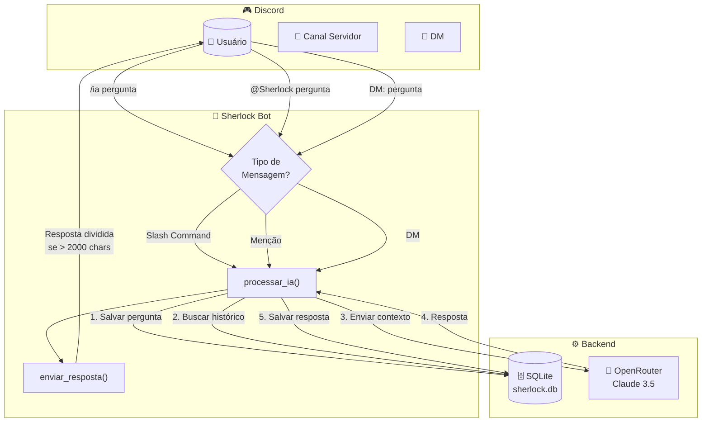
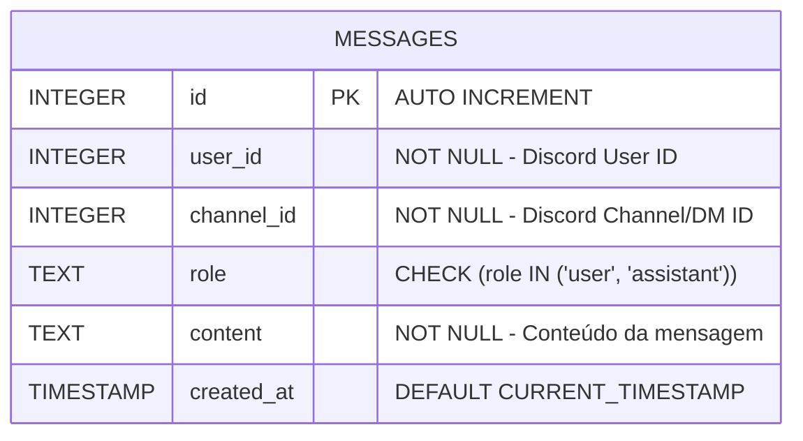

# 🏗️ Arquitetura do Sherlock Bot

## Fluxo UX



## Fluxo de Comandos

```mermaid
sequenceDiagram
    participant U as 👤 Usuário
    participant B as 🤖 Bot
    participant DB as 🗄️ SQLite
    participant AI as 🧠 OpenRouter

    rect rgb(40, 44, 52)
        Note over U,AI: /ia "Qual a capital do Brasil?"
        U->>B: /ia pergunta
        B->>B: defer(thinking=True)
        B->>DB: add_message(user, "pergunta")
        B->>DB: get_context_messages()
        DB-->>B: histórico (até 10 msgs)
        B->>AI: chat.completions.create()
        AI-->>B: resposta
        B->>DB: add_message(assistant, "resposta")
        B->>U: followup.send()
    end

    rect rgb(52, 44, 40)
        Note over U,DB: /limpar
        U->>B: /limpar
        B->>DB: clear_user_history()
        DB-->>B: count removidos
        B->>U: "🗑️ X mensagem(ns) removida(s)"
    end

    rect rgb(40, 52, 44)
        Note over U,DB: /stats
        U->>B: /stats
        B->>DB: get_user_stats()
        DB-->>B: {total_messages, total_channels}
        B->>U: "📊 Suas estatísticas"
    end
```



---

## Schema do Banco de Dados



### Tabela: `messages`

| Coluna | Tipo | Constraints | Descrição |
|--------|------|-------------|-----------|
| `id` | INTEGER | PRIMARY KEY, AUTOINCREMENT | ID único |
| `user_id` | INTEGER | NOT NULL | ID do usuário Discord |
| `channel_id` | INTEGER | NOT NULL | ID do canal/DM |
| `role` | TEXT | CHECK (role IN ('user', 'assistant')) | Papel da mensagem |
| `content` | TEXT | NOT NULL | Conteúdo da mensagem |
| `created_at` | TIMESTAMP | DEFAULT CURRENT_TIMESTAMP | Data/hora |

### Índices

```sql
-- Busca rápida por conversa
CREATE INDEX idx_user_channel ON messages(user_id, channel_id, created_at DESC);
```

---

## Plano de Melhorias

### 🔴 Alta Prioridade

| Melhoria | Descrição | Critérios de Aceitação | Esforço | Prazo |
|----------|-----------|------------------------|---------|-------|
| **Rate Limiting** | Limitar requisições por usuário | 429 retornado após limite; configurável | Médio | 2 dias |
| **Tratamento de Erros** | Retry com backoff para API | Sucesso após erro transiente; log de erro | Baixo | 1 dia |
| **Logging Estruturado** | Usar `loguru` ou `structlog` | Logs em JSON; rotação de arquivos | Baixo | 1 dia |

### 🟡 Média Prioridade

| Melhoria | Descrição | Critérios de Aceitação | Esforço | Prazo |
|----------|-----------|------------------------|---------|-------|
| **Múltiplos Modelos** | Comando `/modelo` para trocar IA | Troca persistente por usuário/canal | Médio | 3 dias |
| **Expiração de Histórico** | Limpar mensagens > 7 dias | Job diário; sem impacto em performance | Baixo | 1 dia |
| **Embeddings** | Respostas formatadas com embeds | Layout visual premium; links clicáveis | Baixo | 1 dia |
| **Contexto por Canal** | Separar histórico por canal | ✅ Implementado | - | - |

### 🟢 Baixa Prioridade (Nice to Have)

| Melhoria | Descrição | Critérios de Aceitação | Esforço | Prazo |
|----------|-----------|------------------------|---------|-------|
| **Sistema de Plugins** | Arquitetura extensível | Carregamento dinâmico de .py | Alto | 7 dias |
| **Dashboard Web** | Painel admin com estatísticas | Login seguro; gráficos em tempo real | Alto | 10 dias |
| **Suporte a Imagens** | Análise de imagens | Suporte a anexos Discord; OCR/Vision | Médio | 4 dias |
| **Threads** | Responder em threads | Criação automática de thread se longa | Médio | 2 dias |
| **Personalização** | Comando `/persona` | System prompt customizável por canal | Baixo | 2 dias |

### 📊 Métricas Sugeridas

```python
# Adicionar ao database.py
def get_global_stats() -> dict:
    """Estatísticas globais do bot."""
    # TODO: Implementar get_global_stats()
    # Retornar:
    # - Total de usuários únicos
    # - Total de mensagens
    # - Média de mensagens por usuário
    pass
```

### 🔒 Segurança

- [ ] Validar tamanho máximo de mensagem (4000 chars)
- [ ] Sanitizar conteúdo antes de salvar
- [ ] Implementar blocklist de usuários
- [ ] Adicionar variável `ALLOWED_GUILDS` para limitar servidores
